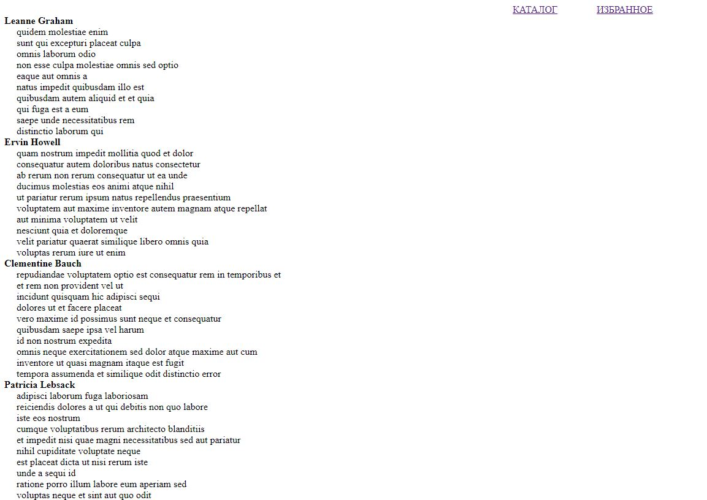
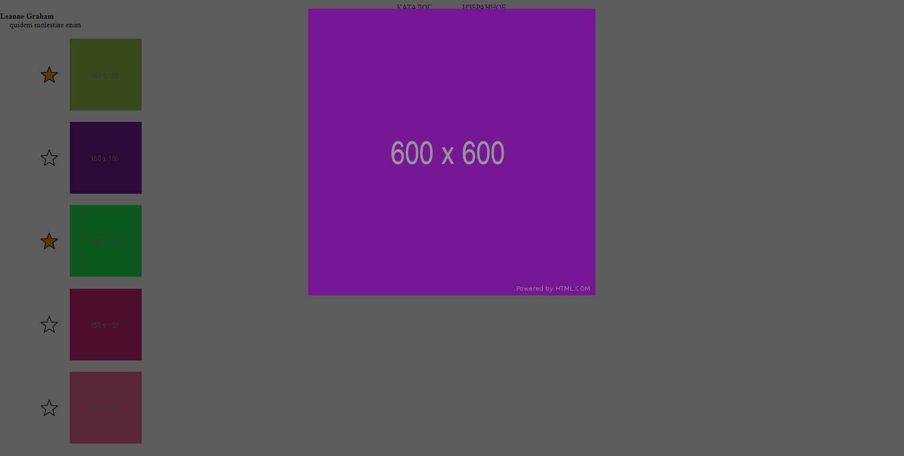
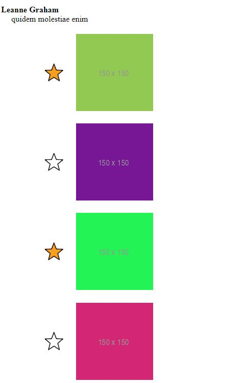

<h1>Что сделано:</h1>

<ul>

<li>Получнеы данные из JSON формата: список Пользователей, список Альбомов для каждого пользователь и Изображения для каждого альбома</li>

<li>Изображения разворачиваются при нажатии на альбом и сворачиваются при повторном нажатии</li>
<li>Каждое маленькое изображение открывается в большое с анимацией: затемнение фона, задержка при открытии/закрытии  
При навежении на маленькле изображение отображается его название</li>

<li>Рядом с каждым изображением есть звездочка, при нажатии она подсвечивается</li>

</ul>
